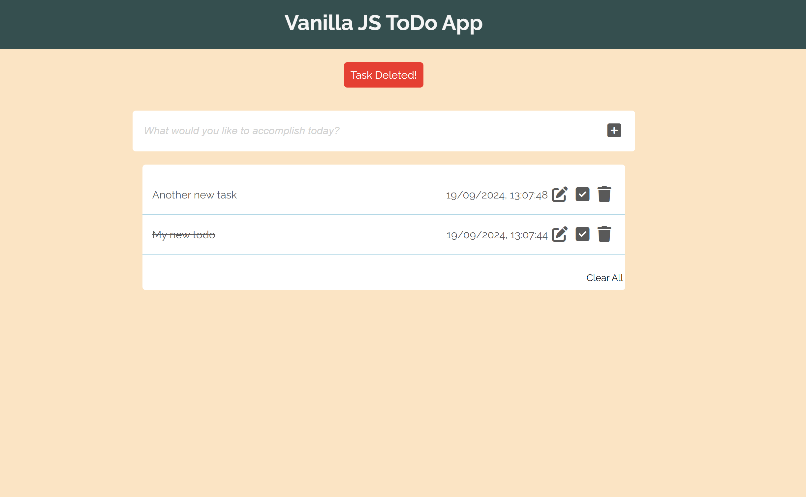

# Vanilla JS ToDo App

### I wanted to go back to basics and show I still have a good handle on Javascript and make sure I'm not overly reliant on packages and libraries

### So I made a simple app for tracking tasks (real original, i know)

### Includes: Task sorting by completion status, as well as creation date/time

### Editable tasks

### Custom deletion alert

